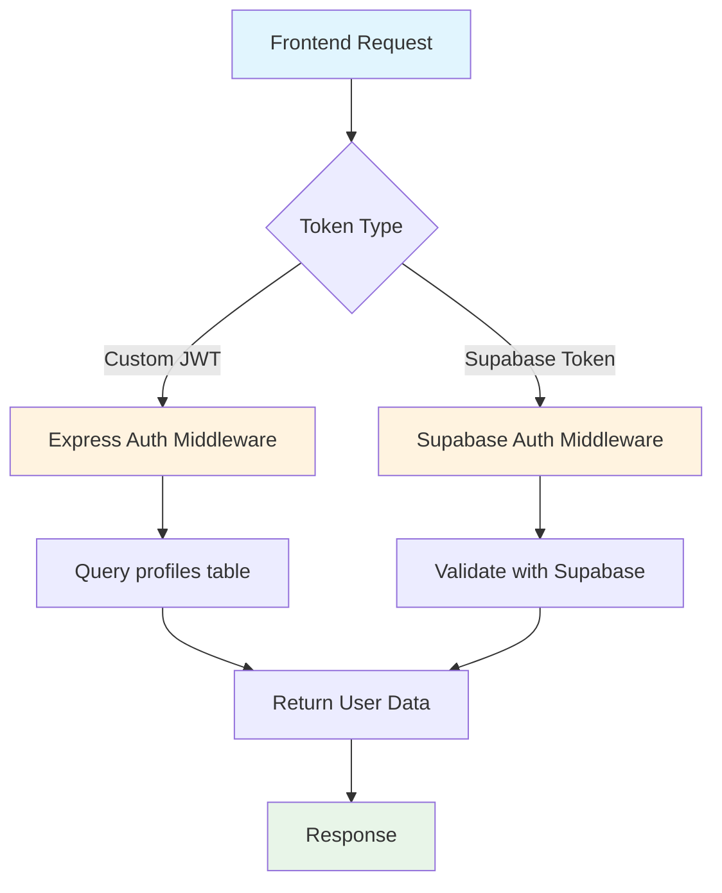

# Backend Architecture Analysis Report

## Executive Summary

The Blitzs Project Hub backend exhibits significant architectural issues stemming from a hybrid approach that combines Supabase authentication with custom Express.js authentication. The system suffers from schema fragmentation, security vulnerabilities, and technical debt that must be addressed immediately to ensure maintainability, security, and scalability.

## Critical Architectural Issues Identified

### 1. Dual Authentication Systems

#### Problem Description

The system implements two competing authentication mechanisms:

- **Supabase Auth** (primary, recommended by documentation)
- **Custom Express Auth** (deprecated, but still active)

#### Technical Details

- Custom JWT tokens generated alongside Supabase sessions
- Passwords stored redundantly in both Supabase Auth and profiles table
- Authentication middleware attempts to validate both token types
- `auth.controller.js` maintains legacy functionality while Supabase Auth is the preferred method

#### Impact

- Security vulnerabilities from duplicate credential storage
- Complex maintenance burden
- Potential for inconsistent authorization
- Increased attack surface

### 2. Schema Fragmentation

#### Problem Description

Three different schema files with conflicting table structures exist:

- `supabase-schema.sql` - Uses `users` table with UUID primary keys
- `supabase-profiles-schema.sql` - Uses `profiles` table linked to `auth.users`
- `supabase-rls.sql` - Contains RLS policies for the `users` table

#### Technical Details

- **Users Table Confusion**: Two different approaches (`users` vs `profiles`)
- **Foreign Key Inconsistencies**: Some tables reference `users.id`, others reference `profiles.id`
- **Role Management Duplicity**: Roles managed in multiple locations
- **Redundant Password Storage**: Password field exists in profiles despite Supabase Auth

#### Impact

- Data integrity risks
- Query complexity and confusion
- Maintenance difficulties
- Potential for orphaned records

### 3. Security Vulnerabilities

#### Hardcoded Credentials

- Supabase URLs and keys exposed in `.env` files
- JWT secrets committed to repository
- Service role keys in plain text

#### Authentication Issues

- Passwords stored in database despite Supabase Auth handling authentication
- Mixed token validation systems
- Insufficient session management

#### RLS Policy Inconsistencies

- Multiple conflicting RLS policy implementations
- Some policies allow public access where it shouldn't be permitted
- Inconsistent authorization checks across the application

## Detailed Issue Analysis

### Authentication Architecture Problems



The diagram illustrates the problematic dual authentication flow that creates unnecessary complexity.

### Schema Inconsistency Map

| Component               | Reference    | Issues                         |
| ----------------------- | ------------ | ------------------------------ |
| projects.added_by       | profiles.id  | Should reference auth.users.id |
| project_reviews.user_id | profiles.id  | Should reference auth.users.id |
| orders.user_id          | profiles.id  | Should reference auth.users.id |
| profiles.password       | VARCHAR(255) | Redundant with Supabase Auth   |

### Security Risk Assessment

| Risk Level | Issue                        | Impact                              |
| ---------- | ---------------------------- | ----------------------------------- |
| CRITICAL   | Hardcoded credentials        | Complete system compromise possible |
| HIGH       | Duplicate password storage   | Increased exposure risk             |
| MEDIUM     | Mixed authentication systems | Potential bypass attacks            |
| MEDIUM     | Inconsistent RLS policies    | Unauthorized data access            |

## Strategic Recommendations

### Phase 1: Authentication Consolidation

#### Objective

Eliminate custom authentication system and standardize on Supabase Auth exclusively.

#### Actions Required

1. **Remove Custom Authentication**
   - Remove all custom JWT generation/verification code
   - Eliminate password hashing utilities from server
   - Remove `hashPassword`, `comparePassword`, and `generateToken` functions
   - Delete custom JWT middleware

2. **Clean Up Database Schema**
   - Remove `password` column from `profiles` table
   - Verify no other tables store passwords
   - Clean up related database constraints

3. **Update Dependencies**
   - Remove `bcryptjs` and `jsonwebtoken` dependencies
   - Update package.json to reflect changes

#### Expected Outcomes

- Single, secure authentication system
- Reduced code complexity
- Eliminated password duplication
- Improved security posture

### Phase 2: Schema Consolidation

#### Objective

Unify database schema to follow Supabase best practices.

#### Actions Required

1. **Standardize User Management**
   - Use `auth.users` as the authoritative user source
   - Maintain `profiles` table only for extended user attributes
   - Ensure all foreign key relationships point to `auth.users.id`

2. **Update Table Relationships**
   - Modify `projects.added_by` to reference `auth.users.id`
   - Update `project_reviews.user_id` to reference `auth.users.id`
   - Adjust `orders.user_id` to reference `auth.users.id`

3. **Refactor RLS Policies**
   - Create unified RLS policy set
   - Remove conflicting policies
   - Implement role-based access consistently

#### Expected Outcomes

- Consistent data model
- Simplified queries
- Proper referential integrity
- Clear separation of concerns

### Phase 3: Security Hardening

#### Objective

Address all identified security vulnerabilities.

#### Actions Required

1. **Environment Configuration**
   - Remove hardcoded credentials from version control
   - Implement proper secret management
   - Configure secure environment variable loading

2. **Access Control**
   - Implement proper RLS policies
   - Ensure minimal necessary permissions
   - Remove overly permissive policies

3. **Audit Trail**
   - Add logging for authentication events
   - Monitor for suspicious activities
   - Implement rate limiting

#### Expected Outcomes

- Secure credential management
- Proper access controls
- Improved monitoring capabilities

## Migration Strategy

### Pre-Migration Preparation

1. **Backup Current System**
   - Full database backup
   - Export all user accounts
   - Document current system state

2. **Staging Environment**
   - Set up isolated test environment
   - Deploy migration scripts to staging
   - Thorough testing before production

### Migration Execution

#### Phase 1: Authentication Cleanup

```bash
# Step 1: Prepare for migration
git checkout -b auth-migration
# Remove custom auth endpoints temporarily
# Update frontend to rely solely on Supabase Auth

# Step 2: Execute database changes
# Remove password columns
# Update foreign key references
```

#### Phase 2: Schema Consolidation

```bash
# Step 1: Update table structures
# Modify foreign key relationships
# Update RLS policies

# Step 2: Validate data integrity
# Run consistency checks
# Verify referential integrity
```

#### Phase 3: Security Implementation

```bash
# Step 1: Update environment configuration
# Remove hardcoded credentials
# Implement secure secret management

# Step 2: Final security audit
# Penetration testing
# Security review
```

### Rollback Plan

- Maintain database snapshots before each phase
- Keep old authentication code in feature flags
- Revert procedures documented for each phase

## Implementation Timeline

While avoiding time estimates as requested, the migration should proceed in the following sequence:

1. Authentication consolidation (highest priority)
2. Schema normalization
3. Security hardening
4. Testing and validation
5. Production deployment

## Success Metrics

- Elimination of dual authentication systems
- Unified database schema with consistent relationships
- Removal of hardcoded credentials
- Successful authentication and authorization flows
- Maintained user experience during migration
- Improved system maintainability

## Conclusion

The current backend architecture presents significant technical debt that must be addressed to ensure the platform's long-term viability. The dual authentication system, schema fragmentation, and security vulnerabilities create unnecessary complexity and risk.

The recommended consolidation approach will simplify the architecture, improve security, and reduce maintenance overhead. Immediate action is required to address the most critical security vulnerabilities, particularly the hardcoded credentials and duplicate password storage.

The phased approach ensures minimal disruption to users while systematically addressing each architectural issue. Success depends on careful planning, thorough testing, and proper rollback procedures at each stage.
